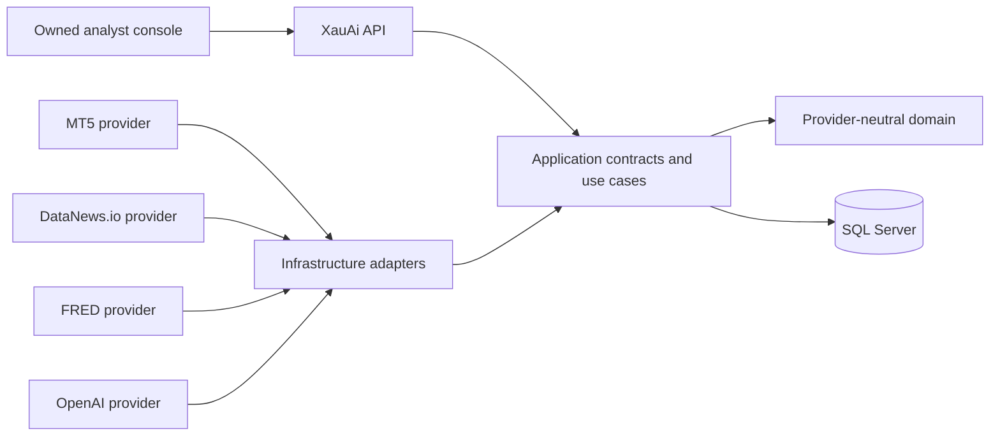

# System overview

## Product boundary

The XAUUSD AI Analyst Trading System is an independent application. Its
architecture is not MT5, DataNews.io, FRED, or OpenAI. Those services are
replaceable providers at the Infrastructure boundary.

The application owns the analyst console, use cases, normalized evidence,
persistence, deterministic calculations, reasoning workflow, signals,
backtests, auditability, and risk policy.

## System flow



Only the MT5 adapter is active in Phase 4. It supplies read-only quotes and
candles through `IMarketDataProvider`. The application maps them to internal
XAUUSD models, returns them through its own API, and persists candles through
its own ingestion use case.

## Backend layers

| Layer | Responsibility | Allowed solution dependencies |
| --- | --- | --- |
| Domain | Core concepts, records, and invariants | None |
| Application | Provider-neutral contracts and use cases | Domain |
| Infrastructure | SQL, cache, and provider adapters | Application, Domain |
| API | HTTP transport, composition, middleware | Application, Infrastructure |
| Web | Owned operational interface consuming API contracts | HTTP API only |

Architecture tests enforce the negative dependency rules. Domain and
Application do not reference MetaTrader or its Python package. Provider code is
isolated under Infrastructure.

## Current operational path

```text
Web market workspace
  -> GET /api/mt5/status
  -> GET /api/market/xauusd/quote
  -> GET /api/market/xauusd/candles
  -> IMarketDataProvider
  -> MT5 Infrastructure adapter
  -> JSON bridge
  -> Windows MetaTrader 5 terminal
```

For persistence:

```text
POST /api/market/xauusd/candles/sync
  -> IMarketDataIngestionService
  -> IMarketDataProvider + IMarketCandleStore
  -> normalized, incremental, idempotent SQL write
```

No part of that flow opens the MT5 interface for the user, and no order
operation is exposed.

## Deterministic and AI responsibilities

Deterministic application code owns calculations that must be reproducible:

- indicators and market measurements;
- signal outcomes and expected value;
- backtesting;
- sample sizes, win rates, and other statistics.

OpenAI will be a reasoning provider for language and contextual synthesis:

- interpreting news and analyst claims;
- connecting technical and macro evidence;
- scenario analysis and explanation;
- producing reasoning grounded in supplied evidence.

AI confidence will never be presented as measured historical accuracy.

## Cross-cutting rules

- SQL Server is the source of truth; Redis is an optional cache.
- All market times are normalized to UTC.
- Every API response carries an `X-Correlation-ID`.
- Client-safe errors expose a stable code, message, and trace ID only.
- Secrets come from environment configuration or a secret manager and are never logged.
- Provider options validate at startup only when that provider is enabled.
- Only `NEXT_PUBLIC_API_URL` crosses the browser configuration boundary.
- External provider types and credentials cannot enter Domain or Application.
- Historical evidence and measured statistics remain immutable and separately auditable.

See [provider integration boundaries](provider-integrations.md) for the live MT5
adapter and the provider-neutral expansion model.
